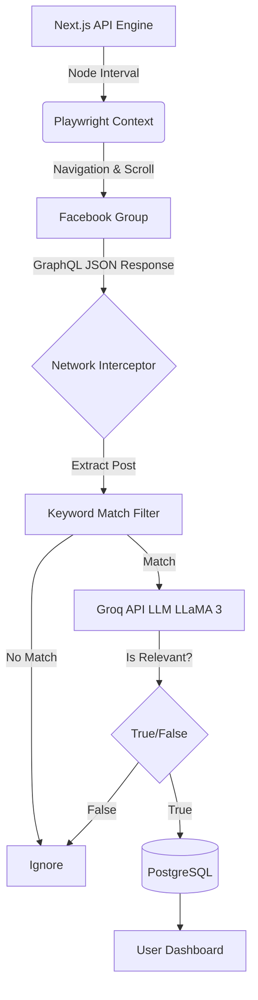
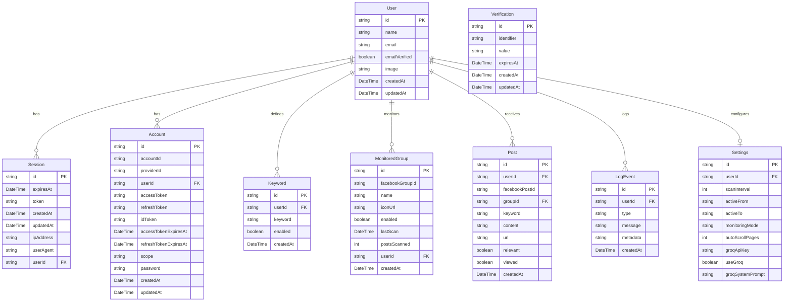

# GroupScout 🎯
*High-Intent Facebook Lead Generation & Monitoring*

GroupScout is a modern, privacy-first Next.js SaaS dashboard that automatically monitors Facebook Groups for high-intent leads using AI (Groq / LLaMA 3). It utilizes a persistent background Playwright engine to silently intercept Facebook's GraphQL network requests, evaluate posts for true buying intent, and capture them seamlessly into your dashboard.

---

## Table of Contents
1. [Project Overview](#project-overview)
2. [How to Use (Quick Start)](#how-to-use)
3. [System Architecture](#system-architecture)
4. [Database Schema (ERD)](#database-schema)
5. [Tech Stack](#tech-stack)

---

## Project Overview

**The Problem:** Finding clients in Facebook Groups requires manual scrolling, searching, and filtering out spam or low-intent posts.
**The Solution:** GroupScout automates the scrolling and reading. You configure target keywords (e.g., "looking for a plumber") and provide an API key. GroupScout's automated Playwright engine runs in the background, securely authenticates using an isolated Chrome profile, and intercepts Facebook's GraphQL traffic to reliably extract posts without relying on brittle DOM scraping. It then passes them to an AI classifier to determine if they are genuine leads before alerting you.

### Key Features
- **Background Playwright Engine:** A robust, persistent headless/headed Chrome instance runs on the backend. It cycles through your monitored groups reliably, removing the need for a brittle Chrome Extension.
- **GraphQL Network Interception:** Instead of visual screen scraping, the engine intercepts raw JSON payloads directly from Facebook's hidden GraphQL API, bypassing un-closeable login walls and UI changes.
- **Smart Active Hours:** The engine respects your configured working hours, staying awake and active during the day, and gracefully shutting down at night.
- **AI Classification:** Uses Groq (LLaMA 3) to filter out noise, ensuring you only see posts with genuine buyer intent.
- **Auto-Sync Metadata:** The engine automatically scrapes and updates Group Names and Cover Photos dynamically.

---

## How to Use

### 1. Installation & Setup
1. Clone the repository and install dependencies (`npm install`).
2. Set up your Next.js `.env` with a PostgreSQL database URL and your encryption keys.
3. Run `npx prisma db push` to initialize your database, followed by `npx prisma generate`.
4. Start the server with `npm run dev`. The background Playwright engine will automatically boot up.

### 2. Usage Workflow
1. **Log In:** Open `http://localhost:3000` and create an account.
2. **Configure Settings:** Go to Settings, add your Groq API key, and configure your Active Working Hours.
3. **Add Keywords & Groups:** Add your target keywords and paste Facebook Group URLs directly into your Groups dashboard.
4. **Start Scouting:** Toggle the engine switch to "Running" in your dashboard. The backend Playwright instance will navigate to the groups, intercept the posts, and surface the leads on your dashboard!

---

## System Architecture

---

## Database Schema

---

## Tech Stack
- **Frontend:** Next.js 16 (React 19), Tailwind CSS, Shadcn UI, Lucide Icons.
- **Backend Engine:** Playwright, Node.js Intervals.
- **Database:** Prisma ORM, PostgreSQL.
- **AI:** Groq SDK (llama-3.1-8b-instant).
- **Authentication:** Better Auth.
