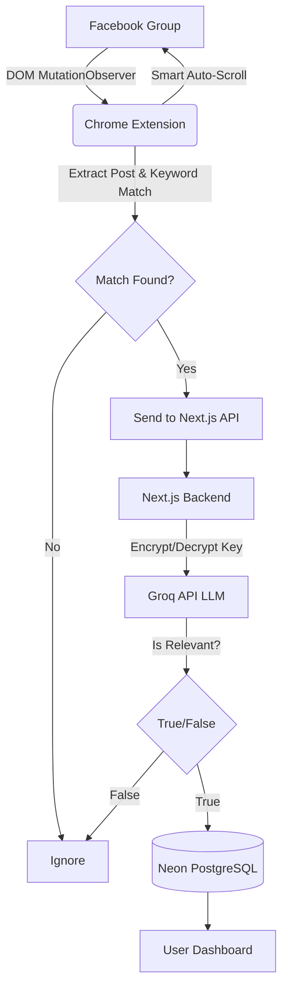
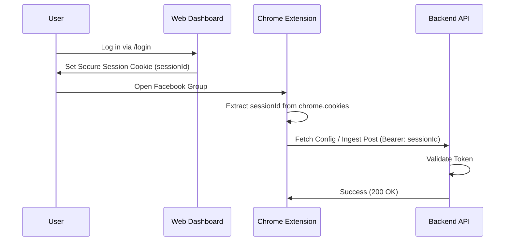
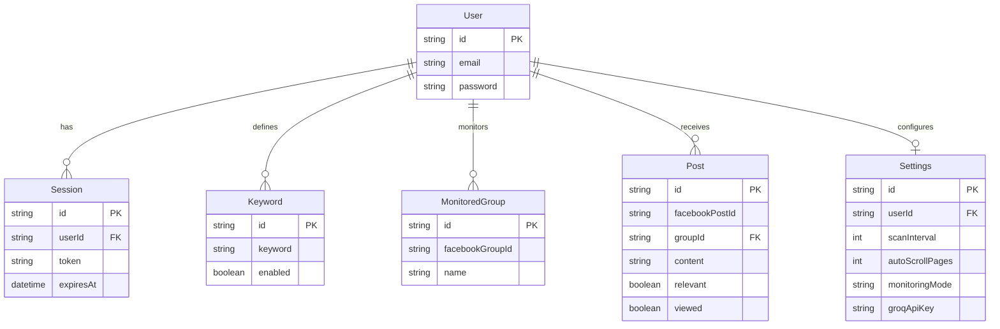

# GroupScout 🎯
*High-Intent Facebook Lead Generation & Monitoring*

GroupScout is a modern, privacy-first Chrome Extension and Next.js SaaS dashboard that automatically monitors Facebook Groups for high-intent leads using AI (Groq / LLaMA 3). It detects posts containing your specific keywords, evaluates them for true buying intent using a lightweight LLM, and captures them silently into your dashboard.

---

## Table of Contents
1. [Project Overview](#project-overview)
2. [How to Use (Quick Start)](#how-to-use)
3. [System Architecture](#system-architecture)
4. [Authentication Flow](#authentication-flow)
5. [Database Schema (ERD)](#database-schema)
6. [Tech Stack](#tech-stack)

---

## Project Overview

**The Problem:** Finding clients in Facebook Groups requires manual scrolling, searching, and filtering out spam or low-intent posts.
**The Solution:** GroupScout automates the scrolling and reading. You configure target keywords (e.g., "looking for a plumber") and provide an API key. GroupScout's extension monitors the groups in real-time, extracts the posts, and passes them to an AI classifier to determine if they are genuine leads before alerting you.

### Key Features
- **Zero-Friction Authentication:** The Chrome Extension securely borrows your web dashboard session. No manual API keys or User IDs to copy/paste.
- **Smart Auto-Scrolling:** The extension can automatically scroll down Facebook group pages to scan posts from the last 5-10 days, dynamically stopping when it hits a post it has already seen.
- **Batched Power Mode:** Instead of crashing your browser by opening 50 tabs at once, GroupScout smartly queues and batches tab openings to emulate human behavior, while actively bypassing browser background throttling.
- **AI Classification:** Uses Groq (LLaMA 3) to filter out noise, ensuring you only see posts with genuine buyer intent.
- **Live AI Dashboard:** See exactly what the AI is scanning in real-time with a live activity feed showing every single post the extension finds and whether it was marked as relevant or ignored.

---

## How to Use

### 1. Installation & Setup
1. Clone the repository and install dependencies (`npm install` in root and `extension/`).
2. Run `npm run build` in the `extension/` folder.
3. Open Chrome, go to `chrome://extensions/`, enable **Developer Mode**, and click **Load unpacked**. Select the `extension/` folder.
4. Set up your Next.js `.env` with a Neon PostgreSQL database and your Encryption Key.
5. Run `npx prisma db push` and `npm run dev`.

### 2. Usage Workflow
1. **Log In:** Open `http://localhost:3000` and create an account.
2. **Configure Settings:** Go to Settings, add your Groq API key, and configure your Auto-Scroll Pages.
3. **Add Keywords:** Add the keywords you want to monitor (e.g., "plumber", "developer needed").
4. **Start Scouting:** Simply open any Facebook Group in your browser. The extension will automatically detect the group, scroll to find posts, and send matches to your dashboard!

---

## System Architecture

---

## Authentication Flow

---

## Database Schema

---

## Tech Stack
- **Frontend:** Next.js 16 (React 19), Tailwind CSS, Shadcn UI, Lucide Icons, Outfit Font.
- **Backend:** Next.js Route Handlers.
- **Database:** Prisma ORM, Neon (Serverless PostgreSQL).
- **Extension:** Manifest V3, ESBuild.
- **AI:** Groq SDK (llama-3.1-8b-instant).
